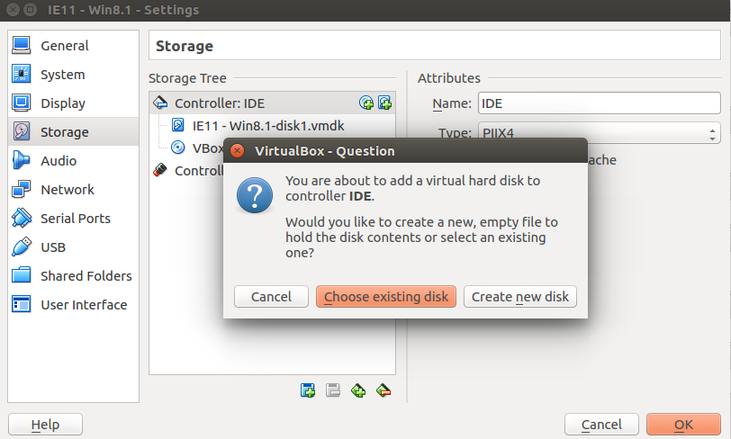
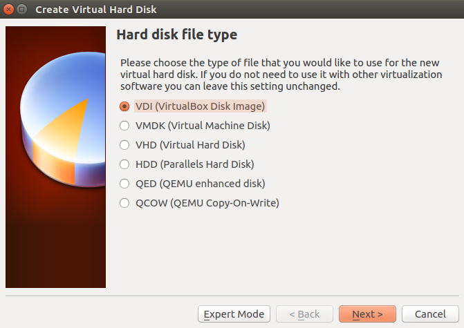
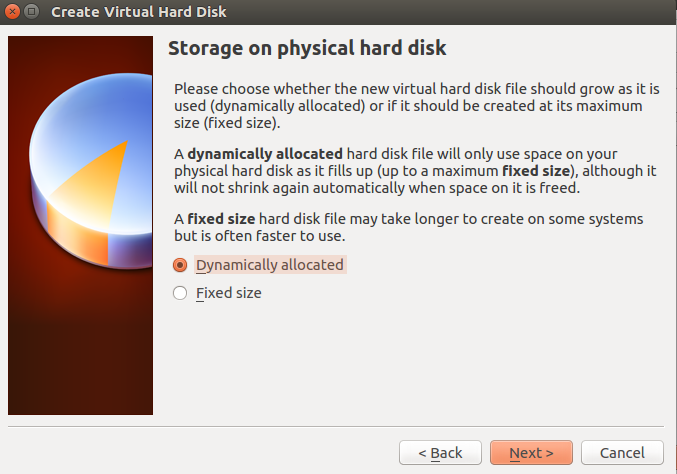
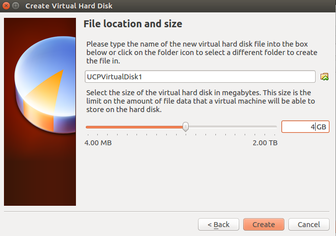
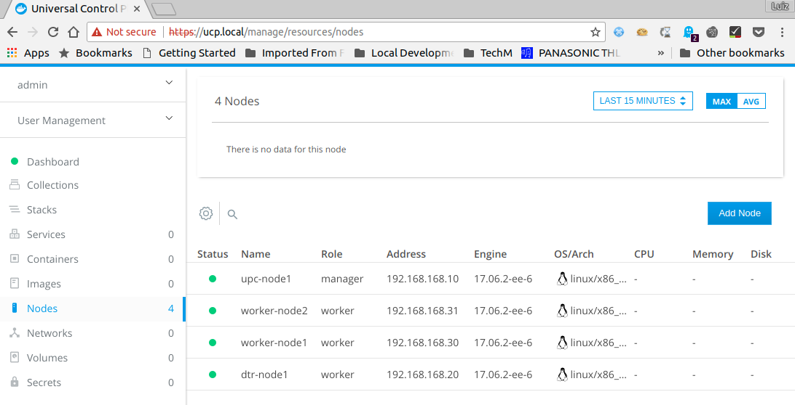
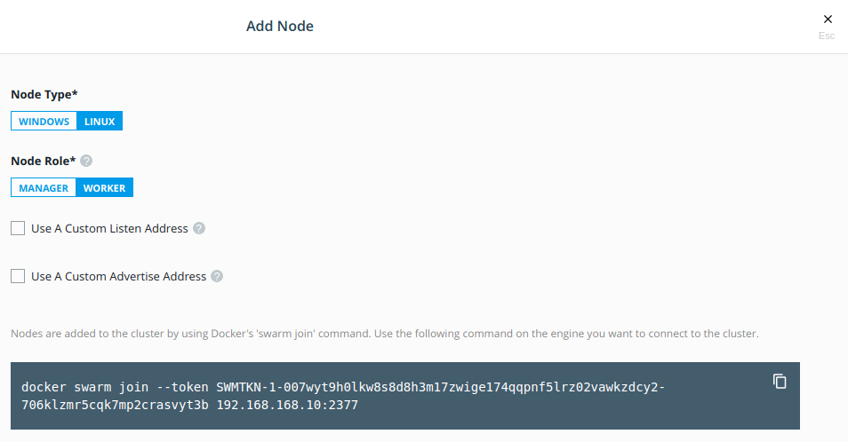
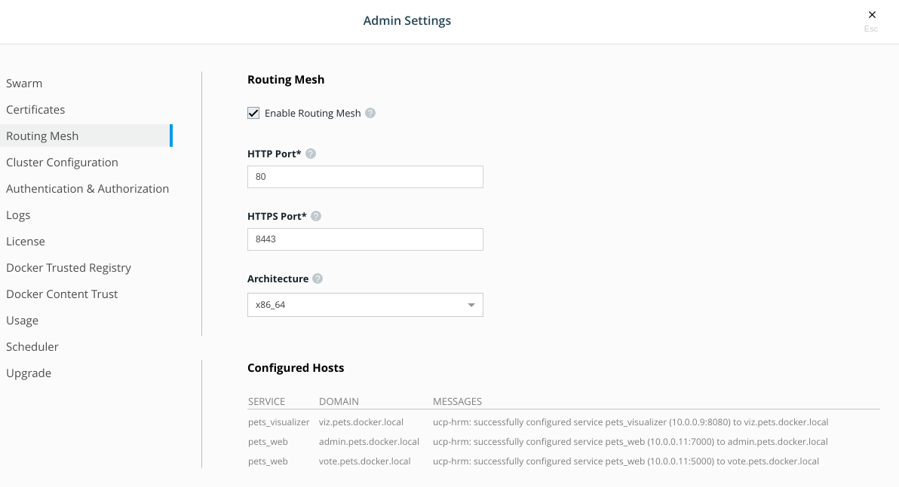

# Docker EE - Pets Application Demo

This demo install and configure Docker EE components (UCP and DTR) and Deploys the dockersample application Pets for demonostration purpose

This installation guide last updated at: 2018-03-08

Centos Version: 7 

Docker Version: 17.06.2-ee-6, build e75fdb8 

## Getting Started

These instructions will get you a copy of the project up and running on your local machine for development and testing purposes. See deployment for notes on how to deploy the project on a live system.

### Prerequisites

What things you need to install the software and how to install them

```
1. VirtualBox
2. Vagrant
3. From the Prerequisties described here begin with getting the Docker EE URL.
   It will look like: https://storebits.docker.com/ee/ubuntu/sub-xxxxx-xxxxx-xxxxx-xxxx-xxxxx-xxxx
4. Create the following DNS
   <UCP-IP> ucp.local vote.pets.docker.local  admin.pets.docker.local viz.pets.docker.local
   <DTR-IP> dtr.local
5. 12Gb Free Memory (1xUCP - 4Gb | 1xDTR - 4Gb | 2xWorkers - 2Gb each | 1xHaProxy - 0.5G)
```

### Installing

1. Create UCP, DTR and 2 workers VM using Centos7
```
$vagrant up ucp --no-provision
$vagrant up dtr --no-provision
$vagrant up worker1 --no-provision
$vagrant up worker2 --no-provision
$vagrant up haproxy [TO DO] Not fully configured / tested
--no-provision parameter is required since the Docker configuration will look for a second hard-disk in the VM called /dev/sdb. We'll create that manually on VirtualBox after the VM get created.
```

2. Stop all VMs (Required to ADD extra VirtualDisk to VM to enable DeviceMapper *Required for Centos Installation)
```
$vagrant halt
```

3. Open VirtualBox and Create the extra Disk required to setup DeviceMapper for all servers except HAProxy (recommended by Docker) - See image below:

3.1 - In the VirtualBox open the setting for each VMs (UCP, DTR, Worker1, and Worker2)


Select "Storage" on the left menu, and click the "+" icon to add hard disk on the right

3.2 - Select Hard Disk File Type


Keep the default - VDI Options

3.3 - Select Storage on Phisical Hard Drive


Keep the default - Dynamic Allocation option

3.4 - Choose File Allocation and Size


Change the name of the file and adjust the proper size for your environment. Click "CREATE" button.

4. Start UCP VM and Execute the provisioning installation / config script
```
$vagrant up ucp
```
5. Start DTR VM and Execute the provisioning installation / config script
```
$vagrant up dtr
```
6. Start Worker1 and Worker2 VM and Execute the provisioning installation / config script
```
$vagrant up worker1
$vagrant up worker2
```
7. Start HAProxy VM (OPTIONAL - Not Properly Configured)
```
$vagrant up haproxy
```
8. Confirm that all nodes are up and running in UCP


9. Install DTR Certifactes in all nodes and run join node command for workers

Get swarm join command from UCP Add Node screen


```
$vagrant ssh ucp
$sh /vagrant/install_dtr_certs.sh

$vagrant ssh dtr
$sh /vagrant/install_dtr_certs.sh
$docker swarm join --token <from-ucp-add-node-screen> <UCP-IP>:2377

$vagrant ssh worker1
$sh /vagrant/install_dtr_certs.sh
$docker swarm join --token <from-ucp-add-node-screen> <UCP-IP>:2377

$vagrant ssh worker2
$sh /vagrant/install_dtr_certs.sh
$docker swarm join --token <from-ucp-add-node-screen> <UCP-IP>:2377
```

10. Enable Route Mesh on UCP


11. Go to UCP server and deploy Pets Stack
```
$vagrant ssh ucp
$docker stack deploy -c /vagrant/apps/pets-prod-compose.yml pets
```
After install pets stack, the routing mesh host configuration were not applied automaticaly. I needed to manually reconfigure the Ingress port configuration to add the Host configuration.

## Authors

* **Luiz Oliveira** - *Initial work* - [PurpleBooth](https://github.com/PurpleBooth)

## License

This project is licensed under the MIT License - see the [LICENSE.md](LICENSE.md) file for details

